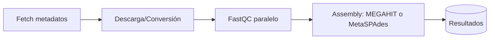

<p align="center">
  
</p>

# **MAGENTA:** The Global **MA**ngrove **GEN**e Ca**TA**logue

[](https://github.com/fjbalvino/magenta/actions/workflows/ci.yml)
[](LICENSE)

---

## 🌍 Description

Mangroves are important reservoirs of biological diversity and highly productive ecosystems.
Several metagenomic studies conducted worldwide have identified mangrove microbial communities as key agents in biogeochemical cycles, where processes such as carbon transformation, photosynthesis, nitrogen fixation, and sulfur reduction occur.

However, there is currently no computational tool that allows us to understand these processes and their interactions at **a global scale**.

**MAGENTA** (o *Global MAngrove GENe CaTAlogue*) actúa como un catálogo global de genes únicos y no redundantes a nivel de especie (agrupados al 95% de identidad de nucleótidos). A partir de datos disponibles en bases de acceso público (WGS, metagenomas de acceso público – ENA) y considerando cinco de los principales hábitats microbianos del manglar (**rizosfera, agua de mar, sedimento, suelo y humedal**), MAGENTA busca formular nuevas hipótesis sobre la abundancia, distribución y funciones metabólicas de los microorganismos en este ecosistema.

---

## 🌍 Geography

MAGENTA leveraged publicly available metagenomic datasets of mangrove ecosystems sourced from the European Nucleotide Archive. In its analysis, MAGENTA systematically excluded incomplete or inconsistent datasets, resulting in **71 pairs of sequencing files** derived from seven distinct studies, spanning **12 geographic locations across three countries: China, India, and the United States**.

<p align="center">
  <a href="https://fjbalvino.github.io/magenta/" target="_blank">
    
  </a>
  <br/>
  <em>Click the image or use the badge below to open the interactive map</em>
</p>

<p align="center">
  <a href="https://fjbalvino.github.io/magenta/">
    
  </a>
</p>


---


## 🗺️ Diagrama (Mermaid)



---

## 📂 Estructura

```
magenta/
├── notebooks/│   └── MAGENTA_preprocessing.ipynb
├── scripts/
│   ├── 01_magenta_fetch_mangrove.py
│   ├── magenta_fetch_non_mangrove.py
│   ├── 02_descargar_y_convertir_mangrove.py
│   ├── descargar_y_convertir_no_mangrove.py
│   ├── 04_fastqc_parallel.py
│   └── 06_assembly_serial.py
├── docs/
│   └── examples.md
├── .github/workflows/ci.yml
├── .gitignore
├── LICENSE
├── Makefile
├── environment.yml
├── requirements.txt
└── README.md
```

---

## 🚀 Quickstart

### 1) Clonar y crear entorno
```bash
git clone https://github.com/fjbalvino/magenta.git
cd magenta

# Opción A: conda (recomendado)
conda env create -f environment.yml
conda activate magenta

# Opción B: venv + pip (necesitarás fastqc/megahit/spades instalados por tu cuenta)
python -m venv .venv && source .venv/bin/activate
pip install -r requirements.txt
```

### 2) Ejecutar flujo mínimo
```bash
# Crea carpetas estándar
make setup

# 1) Fetch de manglares o no-manglar
make fetch_mangrove
# o
make fetch_non_mangrove

# 2) Descarga/Conversión
make download_mangrove
# o
make download_non_mangrove

# 3) QC en paralelo (FastQC)
make fastqc

# 4) Ensamblaje (MEGAHIT/MetaSPAdes según tu script)
make assemble
```

> **Nota:** Si usas `MultiQC`, añade tu comando dentro del target `make qc`.

---

## ⚙️ Variables y rutas

Los scripts trabajan cómodamente si defines variables de entorno como `MAGENTA_DIR` o `MAG_PROJECT_DIR`.  
Puedes exportarlas en tu shell o cargarlas desde `.env`:

```bash
export MAGENTA_DIR="$PWD"
export MAG_PROJECT_DIR="$PWD"
```

---

## ✅ CI (GitHub Actions)

El flujo de **CI** corre:
- **Black + Flake8** (formato y linting de código)
- Un _smoke test_ que invoca `--help` en cada script para verificar que el repositorio se mantiene saludable.

---

## 🤝 Contribuir

Lee [CONTRIBUTING.md](CONTRIBUTING.md) para pautas de estilo y PRs.

---

## 📜 Licencia

Este proyecto está bajo licencia [MIT](LICENSE).
