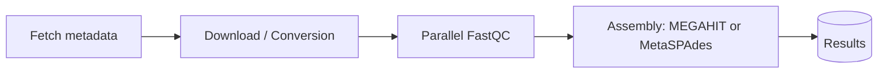

<p align="center">
  
</p>

# **MAGENTA:** The Global **MA**ngrove **GEN**e Ca**TA**logue

[](https://github.com/fjbalvino/magenta/actions/workflows/ci.yml)
[](LICENSE)

---

## 🌍 Description

Mangroves are important reservoirs of biological diversity and highly productive ecosystems.
Several metagenomic studies conducted worldwide have identified mangrove microbial communities as key agents in biogeochemical cycles, where processes such as carbon transformation, photosynthesis, nitrogen fixation, and sulfur reduction occur.

However, there is currently no computational tool that allows us to understand these processes and their interactions at **a global scale**.

**MAGENTA** (or Global MAngrove GENe CaTAlogue) serves as a global catalog of unique, non-redundant genes at the species level (clustered at 95% nucleotide identity). It is built from publicly available datasets (WGS and public-access metagenomes from ENA) and considers five major mangrove microbial habitats (**rhizosphere, seawater, sediment, soil, and wetland**). MAGENTA aims to generate new hypotheses about the abundance, distribution, and metabolic functions of microorganisms in this ecosystem.

---

## 🌍 Geography

MAGENTA leveraged publicly available metagenomic datasets of mangrove ecosystems sourced from the European Nucleotide Archive. In its analysis, MAGENTA systematically excluded incomplete or inconsistent datasets, resulting in 71 pairs of sequencing files derived from seven distinct studies, spanning **12 geographic locations across three countries: China, India, and the United States**.

<p align="center">
  <a href="https://fjbalvino.github.io/magenta/" target="_blank">
    
  </a>
  <br/>
  <em>Click the image or use the badge below to open the interactive map</em>
</p>

<p align="center">
  <a href="https://fjbalvino.github.io/magenta/">
    
  </a>
</p>


---


## 🗺️ Workflow Diagram (Mermaid)



---

## 📂 Structure

```
magenta/
├── notebooks/│   └── MAGENTA_preprocessing.ipynb
├── scripts/
│   ├── 01_magenta_fetch_mangrove.py
│   ├── magenta_fetch_non_mangrove.py
│   ├── 02_descargar_y_convertir_mangrove.py
│   ├── descargar_y_convertir_no_mangrove.py
│   ├── 04_fastqc_parallel.py
│   └── 06_assembly_serial.py
├── docs/
│   └── examples.md
├── .github/workflows/ci.yml
├── .gitignore
├── LICENSE
├── Makefile
├── environment.yml
├── requirements.txt
└── README.md
```

---

## 🚀 Quickstart

### 1) Clone Repository and Set Up Environment
```bash
git clone https://github.com/fjbalvino/magenta.git
cd magenta

# Opción A: conda (recomendado)
conda env create -f environment.yml
conda activate magenta

# Opción B: venv + pip (necesitarás fastqc/megahit/spades instalados por tu cuenta)
python -m venv .venv && source .venv/bin/activate
pip install -r requirements.txt
```

### 2) Run Minimal Workflow
```bash
# Create standard directories
make setup

# 1) Fetch mangrove or non-mangrove data
make fetch_mangrove
# or
make fetch_non_mangrove

# 2) Download / Conversion
make download_mangrove
# or
make download_non_mangrove

# 3) Parallel QC (FastQC)
make fastqc

# 4) Assembly (MEGAHIT / MetaSPAdes according to your script)
make assemble

```

> **Note:** Note: If you use MultiQC, add your command inside the 'make qc' target..

---

## ⚙️ Variables and Paths

The scripts work smoothly if you define environment variables such as MAGENTA_DIR and MAG_PROJECT_DIR.
You can export them in your shell or load them from a '.env' file:

```bash
export MAGENTA_DIR="$PWD"
export MAG_PROJECT_DIR="$PWD"
```

---

## ✅ CI (GitHub Actions)

El flujo de **CI** corre:
- **Black + Flake8** (code formatting and linting)
- A  _smoke test_ that invokes `--help` on each script to ensure the repository remains healthy.
---

## 🤝 Contributing
Please read CONTRIBUTING.md for coding style guidelines and pull request (PR) instructions.


---

## 📜 License

This project is licensed under the [MIT](LICENSE).
